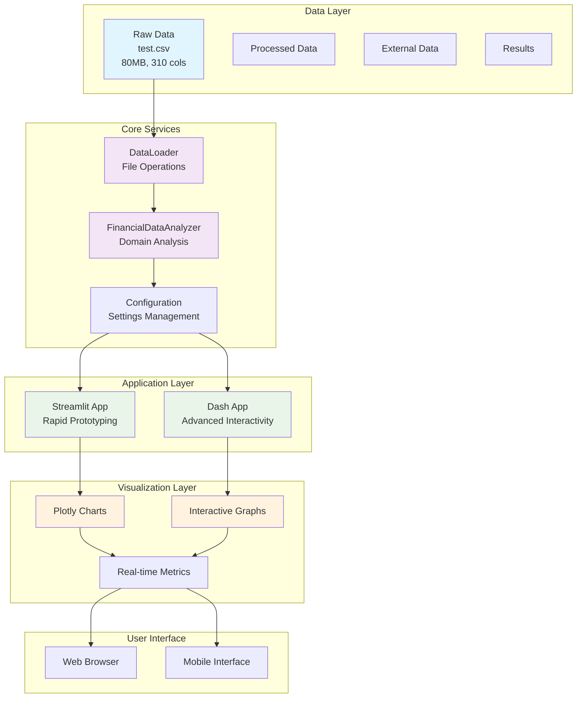
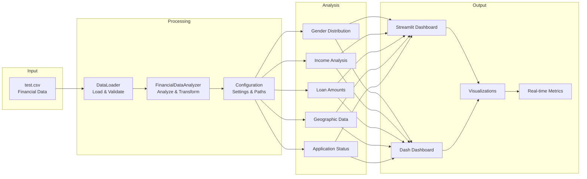
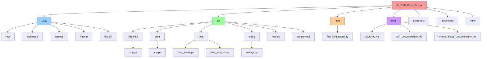
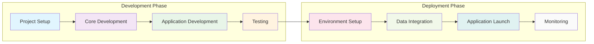
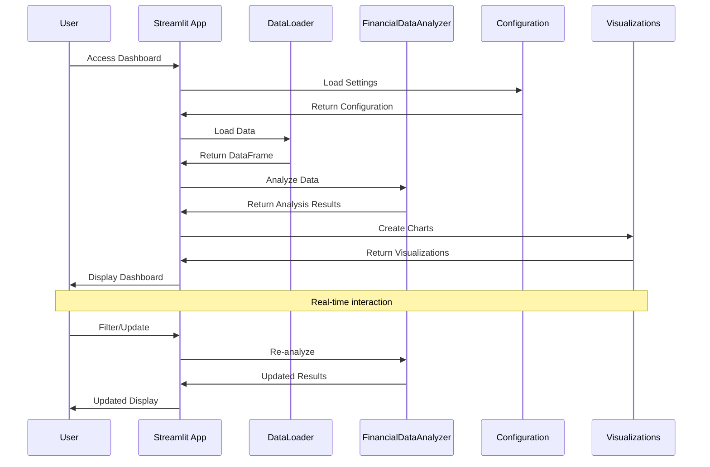
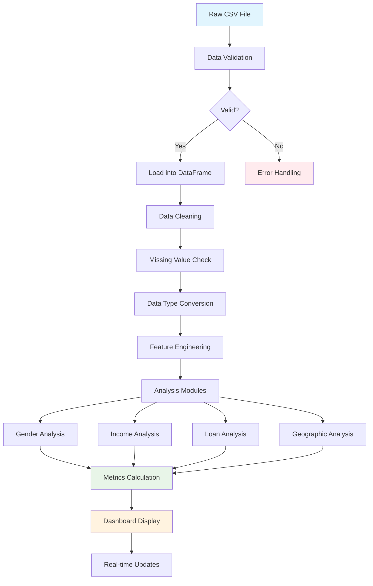
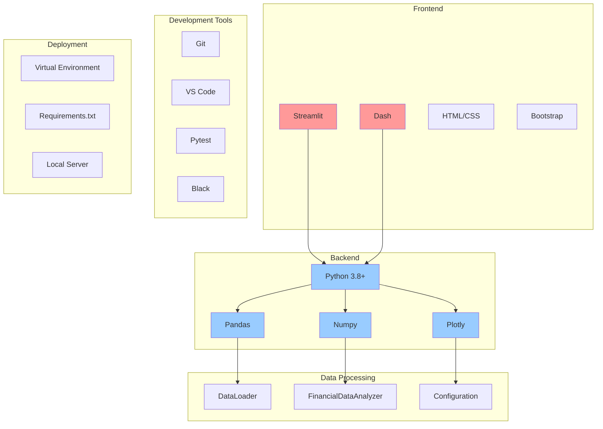
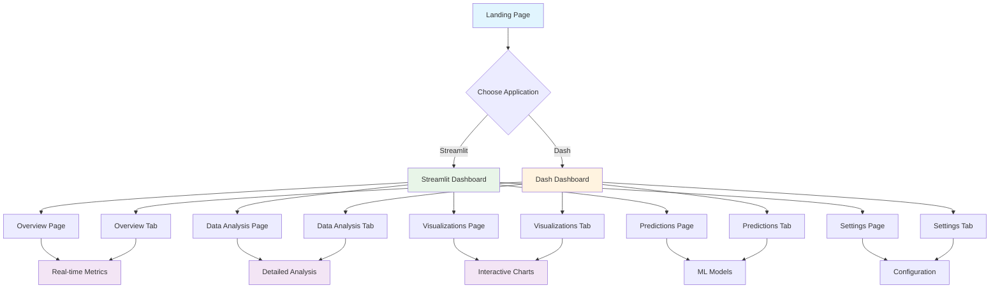
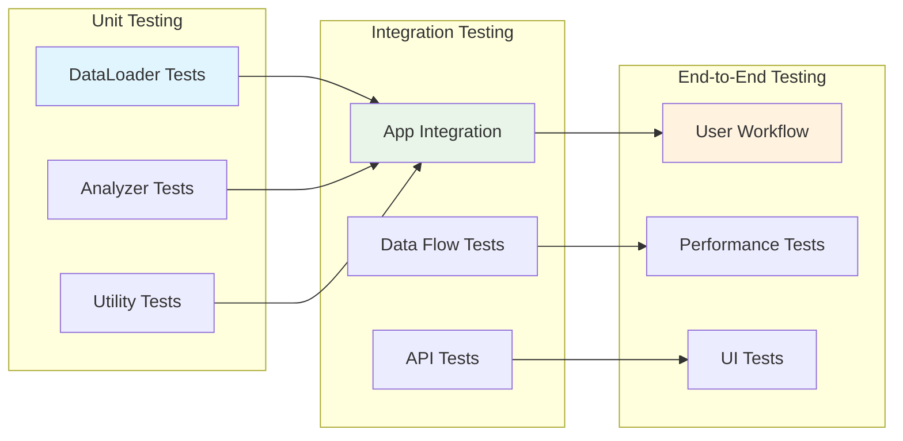

# Architecture Diagrams

This document contains all the Mermaid diagrams for the Streamlit & Dash Insights Project.

## 🏗️ System Architecture

## 📊 Data Flow Diagram

## 📁 Project Structure

## 🔄 Development Workflow

## 🎯 Component Interaction

## 📈 Data Processing Pipeline

## 🔧 Technology Stack

## 🎨 User Interface Flow

## 🔍 Testing Strategy

---

**Note**: These diagrams can be rendered in any Markdown viewer that supports Mermaid syntax, such as GitHub, GitLab, or VS Code with the Mermaid extension. 